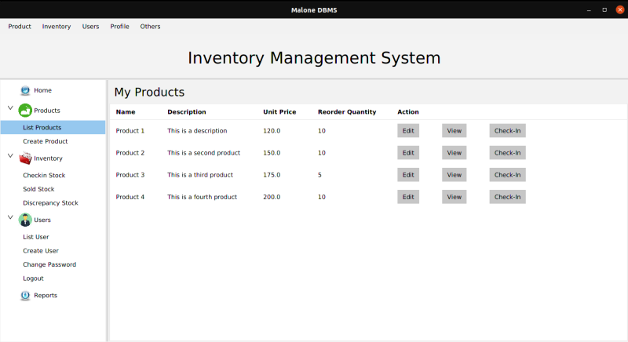

# A Simple Stock Manager


## Table of Contents
* [Technologies Used](#technologies-used)
* [Features](#features)
* [Setup](#setup)
* [Project Status](#project-status)
* [Room for Improvement](#room-for-improvement)
* [Contact](#contact)


## Technologies Used
- __Java__ 17
- __JavaFx__ - version 11
- __Mysql-connector-J__ - version 8.3.0
- __hibernate.orm__ - version 6.2.5
- __hibernate.validator__ - version 6.2.5
- __hibernate-c3p0__ - version 6.2.5
- __jakarta.el__ - version 6.2.5
- __slf4j__ - version 6.2.5


## Features
### 1. User
- Create, Read, Update & Delete user
- Assign Roles: ADMIN or STOREKEEPER


- Login
- Change password


### Products
- Create, Read, Update & Delete Product





### Stock Inventory
- Checkin product item to Stock


- Sell / Checkout product item from Stock


- Add product item to Discrepancy stocks


- List Current Stocks, Discrepancy stock and Sold stock


### Reports
- Daily, Weekly, Monthly and Yearly product Sales
- Sale ratio


## Setup
- The project requires JDK 17 and above, install it before you run. 

- It is configured with `maven wrapper`, you do not need to install maven to compile it. Just open the Command Line Interface and change directory to the root of the project. To compile the project run the following command:
```bash
./mvnw clean install
```

- To execute the compiled classes use the following command line: 
```bash
./mvnw exec:java
```

## Project Status
Project is: _in progress_

## Room for Improvement
Include areas you believe need improvement / could be improved. Also add TODOs for future development.

Room for improvement:
- Daily, Weekly, Monthly and Yearly product Sales
- Dashboard

To do:
- user Audit


## Contact
Created by [@malone](https://elkanahmalonza.netlify.app/) - feel free to contact me!
